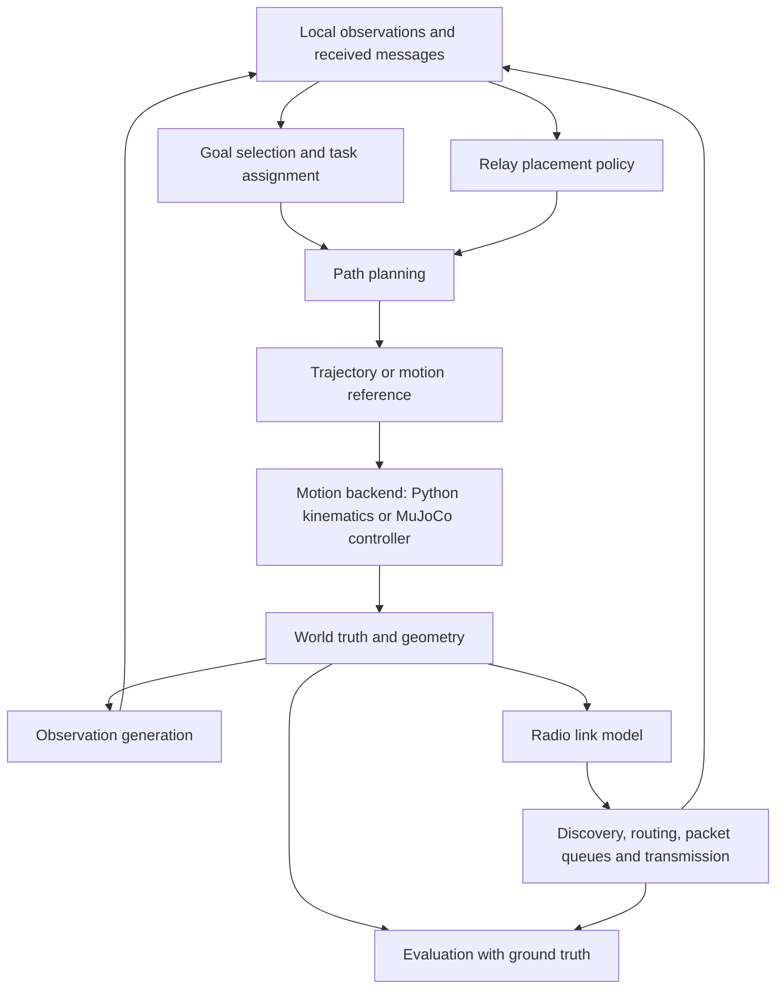

# Algorithm simulation and MuJoCo integration plan

Status: proposed architecture and development sequence. The Step 0 MuJoCo
backend is implemented; the algorithm simulator and algorithms below are not.

## Purpose

Develop goal selection, navigation, relay movement, routing, and scheduling in
a small deterministic Python simulator. Keep those implementations independent
of the motion backend, then validate selected experiments using the existing
MuJoCo vehicles. Increase model detail only when it can affect the conclusion
of an experiment. A detailed drone model is unnecessary to verify Dijkstra or
packet queue discipline; motion timing can still affect their integrated behavior.

Perfect state feedback does not make actual motion equal a desired reference.
The Step 0 controller still generates rotor forces and MuJoCo integrates the
resulting motion. Its small nonzero tracking errors show that distinction.
Ground truth removes estimation error from this particular experiment.

## Shared stack

Networking runs alongside motion, not as a stage between the planner and motor
controller. Local stabilization remains operational during communication loss.
Relay placement determines positions; routing determines packet next hops.
Their effects couple through changing geometry, link quality, and eventually
queue backlog. Initially test these policies independently.

Reuse the existing simulator-independent `State` and `Reference` types as the
motion boundary. High-level algorithms produce position, velocity, acceleration,
and yaw references. The Python backend follows these with bounded kinematics;
the MuJoCo adapter follows them with the existing cascaded controller and rotor
actuators. Mission policies and networking never command raw MuJoCo controls.

Proposed additional boundaries, introduced only as required:

| Boundary | Data or responsibility |
|---|---|
| Motion backend | Advance to a simulation time; receive references; expose actual state |
| Observation source | Timestamped state estimate, local map, validity and optional uncertainty |
| Agent policy | Local observation/cache and delivered messages to goals or motion references |
| World geometry | Collision and line-of-sight queries with vehicle-specific clearance |
| Link model | Directional delivery probabilities and configured link capacity |
| Router | Destination and available topology information to next hop |
| Scheduler | Queues, priorities, deadlines, radio availability to transmission selection |
| Evaluator | Truth, references and event logs to metrics and plots |

The current `common`, `network`, `mapping`, `strategies`, and `metrics` module
boundaries can house these algorithms. They are currently placeholders. Add a
small `simulation` package for the common experiment clock and kinematic backend
when needed; retain `mujoco` as the physics adapter. Avoid a second implementation
of planners or routers inside `mujoco`.

## Initial Python model

Start Step 1 with analytic or scripted positions. Graph testing does not need a
new vehicle dynamics engine. Once planners or relay motion are introduced, add
a bounded point-agent motion model:

`p[k+1] = p[k] + v[k] dt + 0.5 a[k] dt²`

`v[k+1] = v[k] + a[k] dt`

Apply vehicle-specific speed and acceleration constraints consistently during
integration. Log unreachable or constrained references. Represent vehicle
clearance using a configured disk/sphere radius derived conservatively from its
geometry. A point-agent planner must not route the mapper through a gap narrower
than its swept propeller footprint. Keep the world in SI units and ENU-like axes.

Use axis-aligned building geometry initially, shared with the MuJoCo world YAML.
For navigation, begin at fixed flight altitude on a 2D occupancy grid. Building
footprints intersecting that altitude are occupied; inflate them by clearance.
This tests route selection without prematurely building 3D voxel planning.
Retain 3D positions for radio line-of-sight and later physical validation.

The world knows obstacle truth. A planning algorithm receives either an explicitly
declared fully known map baseline or a partial map. Do not give an exploration
policy the full map and report its results as exploration of unknown space.
Later, a geometric visibility/reveal model can isolate exploration behavior
without pretending to reproduce Unitree scans or implementing SLAM.

Use one simulation clock, separate policy/motion/network update rates, seeded
random streams, and stable event ordering. Network events carry timestamps; when
packet modeling arrives, schedule transmission duration, arrivals, deadlines,
and retry completion as events. Motion advances to the relevant event times.
Do not round all packet timings to the motion timestep or viewer frame rate.

## Truth versus information available to agents

Keep three separate concepts:

1. Actual state: physical position used for collisions and radio propagation.
2. Own state estimate: information used by a local controller or planner.
3. Remote state cache: last received information about other drones, with age.

For early experiments, own estimates can equal truth. Remote information can
still become delayed, stale, or unavailable through the simulated network.
Centralized policies may use global truth as an explicitly named baseline;
distributed policies must operate on their delivered observations/messages.
The evaluator can always access truth to measure error and mission performance.

To test imperfect information later, introduce selected impairments independently:
sample-and-hold updates, delays, bias, slowly varying drift, dropouts, and noise.
A pose approximation can be `p_hat(t) = p(t-delay) + bias(t) + noise(t)` with
configured units and a timestamp. This is a robustness model, not a SLAM system.
Local estimation impairments and network-induced remote staleness are separate
experimental variables. Do not start by adding every impairment simultaneously.

## Where MuJoCo provides useful evidence

MuJoCo is a dynamics/contact engine with actuation and visualization support;
it does not supply a Wi-Fi propagation or queueing model. See the official
[overview](https://mujoco.readthedocs.io/en/stable/overview.html) and
[dynamics computation reference](https://mujoco.readthedocs.io/en/stable/computation/index.html).

Use it when a conclusion depends on physical execution:

- Can the mapper follow the generated reference without saturating its rotors?
- Does a turn or braking maneuver violate clearance or agent separation?
- Does a relay reach its target before a moving mapper loses connectivity?
- Does tracking error change line-of-sight or cause network disconnection?
- Are policy update intervals compatible with actual motion response?
- Are the different vehicle sizes, inertia, and control limits significant?

The same radio and packet models operate on actual MuJoCo positions. RF behavior
does not become more accurate merely because it is visualized in MuJoCo. Move
selected scenarios into physics validation as each motion-dependent algorithm
matures; do not postpone all integration until the full stack is finished.

## Milestones and algorithm design

| Milestone | First baseline | Question and primary metrics |
|---|---|---|
| 1: communication graph | Scripted motion, distance/LOS model, directional delivery probabilities, ETX | When and why does a mapper lose ground-station reachability? Availability, outage duration, link quality |
| 2: routing | Centralized ETX-weighted Dijkstra | Which route is selected and how does it change? Route cost, hop count, changes; ideal graph baseline initially |
| 3: packet transport/scheduling | Bounded queues, FIFO; compare strict priority and hybrid priority/DRR | Can bulk mapping traffic coexist with control traffic? P95/P99 delay, goodput, drops, fairness |
| 4: navigation | Known occupancy map, inflated A*, bounded reference follower | Can the vehicle reach assigned goals? Success, path length, clearance, planning time |
| 5: relay placement | Static relays, then equally spaced chain, then link-aware placement | Does relay motion improve connectivity? Availability, movement, transition outages |
| 6: trajectory/control refinement | Existing PD baseline; compare advanced tracking when warranted | Is the mission physically executable? Tracking, constraint violations, control effort |
| 7–9: mapping and goal selection | Truth-pose map baseline, then frontier selection and task assignment | Is new area discovered efficiently? Coverage rate, overlap, travel, map-transfer delay |
| 10+: joint policy and recovery | Compare independent policies against network-aware policies | Does coupling improve delivered useful map data and resilience? Coverage, latency, disconnections, recovery |

The table preserves the existing staged roadmap. It is not authorization to
implement all milestones together. Navigation can initially use assigned goals;
autonomous exploration goal selection requires a defined partial-map interface.
Do not begin with a monolithic weighted objective before independent baselines
are measurable.

For each algorithm, define its inputs, information assumptions, output, update
interval, objective, constraints, tie-breaking, and failure behavior before code.
Examples: A* reports unreachable goals; a router reports no available next hop;
an exploration policy reports no frontier; a relay policy distinguishes an
unachievable connectivity requirement from a temporary poor placement.

Later goal-selection utility can combine normalized information gain, travel
cost, overlap, and connectivity risk. Begin with nearest-frontier selection,
then evaluate each added term against that baseline. Use Hungarian assignment
for the first centralized multi-mapper task allocation. Relay assignment and
continuous placement are separate problems from network route selection.

## Concrete next experiment: Step 1

Implement a headless Python runner with one mapper, two relays, and a ground
station; counts remain configurable. Prescribe paths and use the supplied simple
building geometry. Begin with these reproducible scenarios:

1. Static relay chain with a known connected graph.
2. Mapper moving until its final link weakens or disappears.
3. An obstacle blocking a line of sight while distance remains similar.
4. Asymmetric forward/reverse delivery probabilities.
5. A relay disappearing, with corresponding graph reachability loss.

Choose toy link parameters that make these cases observable and label them
uncalibrated. They are not claims about VoCore aerial range or goodput.

For each usable neighbor link, define
`ETX(i,j) = 1 / (P_forward(i,j) * P_reverse(i,j))` under the baseline independent
attempt/acknowledgment assumptions. Zero probability gives an unusable/infinite
cost link. Directional probabilities are retained even though this two-way
product yields a symmetric ETX under the shared forward/reverse pair model.
ETX represents expected attempts in this abstraction, not application bandwidth.

Expose a ground-truth link-model baseline first. Later use sampled probes and
an estimator to study discovery delay, noisy estimates, and route hysteresis.
Do not interpret known model probabilities as measured radio quality.

Visualize vehicle paths with graph edges, delivery probabilities/ETX, and
ground-station reachability. Plot availability and outage intervals over time,
plus link-quality curves. Test distance changes, LOS obstruction, asymmetry,
zero-probability links, failed nodes, and reproducibility.

Only graph/link modeling is implemented in this first experiment. Route selection
and packet throughput/latency measurements begin in their subsequent milestones.
Once the Python graph is correct, connect it to actual positions from the Step 0
MuJoCo adapter and display the same edges there. This validates the integration
without rewriting the graph algorithms.
